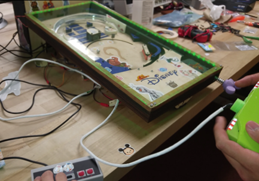
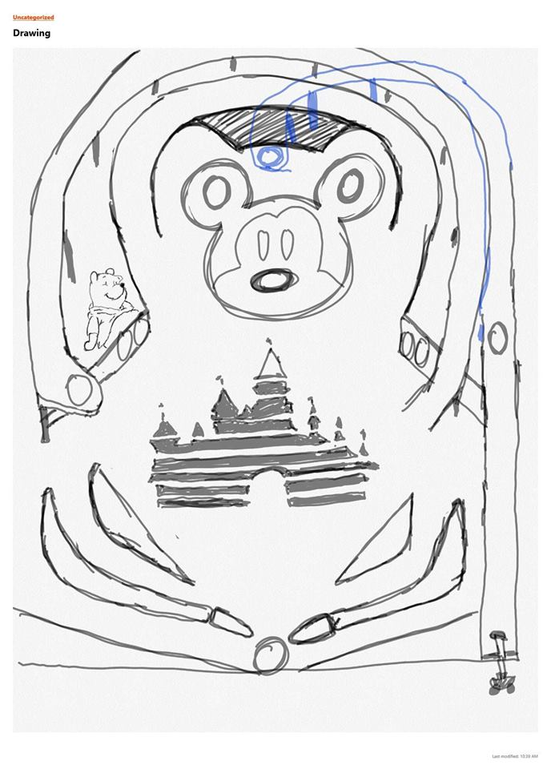

## ECE 115 Disney Themed Pinball Machine

```
Picture of the pinball machine and it's two external controllers
```

## Description
[Link to PDF](https://drawsome1.github.io/Pinball_Machine/PinballProjectDescription.pdf)

## Collaborators
**Richard Chum** and **Kevin Tain**

## Objective
```
The purpose of this project is to have students familiarize themselves with
rapid prototyping techniques. Going through the complete cycle of prototyping
from sketch to testing. We implemented 3D printing and laser cutting to aid our
prototyping. Along with obtaining the knowledge and mindset required for rapid
prototyping we also learned how to operate Servo motors, Solenoids, IR Sensors,
Piezo Dielectric, buttons, 7-Segment LEDs as well as different types of
mechanical joints. Additionally, as we developed the ability to rapidly
prototype we also focused on the design of the pinball machine. The pinball
machine is completely modular that way if one part breaks the entire system
still works. 
```

# The Process
We began with an initial sketch of what we hoped the pinball machine would look
like



### Mechanical Design Specification
```
1. Maximum length of the board must be less than or equal to 24 inches
2. Maximum width of the board myst be less than or equal to 12 inches
3. Minimum width of the walls on the playfield must be greater than or equal to
10mm
4. Minimum distance between walls must be greater than or equal to 15mm
5. Minimum distance height of the playfield must be greater than 30mm
6. Ball must naturally fall down towards paddles
7. The angle of the playfield must be between 0 degrees and 45 degrees
8. Minimum width of the ramp must be greater than or equal to 15mm
```

Then we developed a cardboard prototype to test the feasability of our design
concepts.


After multiple iterations of the pinball machine we were able to develop our
final CAD (Computer Aided Design) of the pinball machine on AutoDesk Fusion360. 
On the way here we constructed testbeds for each component and improved upon 
each subsystem based on the results we recieved. After confirming our mechanical
design we were also able to plan how each electrical component would be wired.


```
Complete CAD of the final pinball machine design.

```


```
A schematic of how our electrical components were connected.
```


this is to prove that it updated 6

