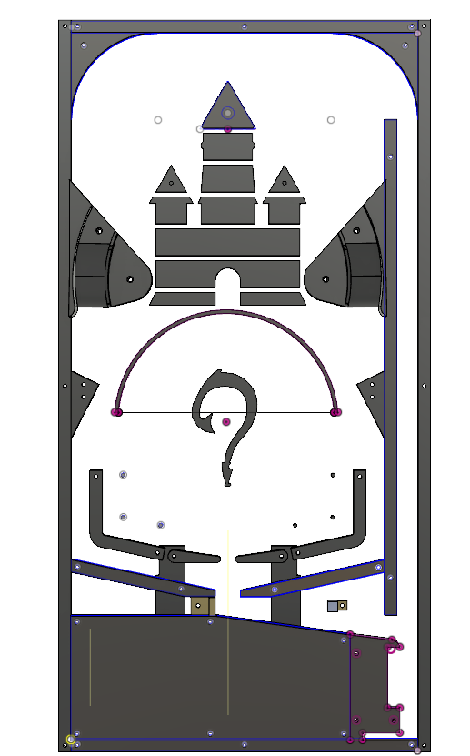

## ECE 115 Disney Themed Pinball Machine

```
Picture of the pinball machine and it's two external controllers
```


## Description
[Link to PDF](https://drawsome1.github.io/Pinball_Machine/PinballProjectDescription.pdf)


## Collaborators
**Richard Chum** and **Kevin Tain**


## Objective
```
The purpose of this project is to have students familiarize themselves with
rapid prototyping techniques. Going through the complete cycle of prototyping
from sketch to testing. We implemented 3D printing and laser cutting to aid our
prototyping. Along with obtaining the knowledge and mindset required for rapid
prototyping we also learned how to operate Servo motors, Solenoids, IR Sensors,
Piezo Dielectric, buttons, 7-Segment LEDs as well as different types of
mechanical joints. Additionally, as we developed the ability to rapidly
prototype we also focused on the design of the pinball machine. The pinball
machine is completely modular that way if one part breaks the entire system
still works. 
```


# The Process
We began with an initial sketch of what we hoped the pinball machine would look
like


Then we developed a cardboard prototype to test the feasability of our design
concepts.


After multiple iterations of the pinball machine we were able to develop our
final CAD (Computer Aided Design) of the pinball machine on AutoDesk Fusion360. 
On the way here we constructed testbeds for each component and improved upon 
each subsystem based on the results we recieved. After confirming our mechanical
design we were also able to plan how each electrical component would be wired.



```
Complete CAD of the final pinball machine design.
```


```
A schematic of how our electrical components were connected.
```

## Key Highlights
### Controllers
We decied to remove the controlls for the system away from the traditional
design (attached to the side) and made external controllers, like those of a
traditional gaming system.

* **Buzz Lightyear** - this controller is completely 3D printed and it houses 3
mechanical switches. Two of the switches are used to controll the left and right
paddles, and the last switch is used to turn on/off the system. This controller
has also gone through the complete cycle of rapid prototyping (sketch, mock,
CAD, prototype, repeat until satisfied), and the inspiration behind it is a pun.
Why not use a toy (Buzz Lightyear) to controll a toy, the pinball machine.

* **Old school NES controller** - this controller was initially implemented as a
back-up for the Buzz Lightyear controller, but was repurposed for the advance
mode. Whereas Buzz has only 3 controlls, the NES controller has 6 functional
buttons. This controller was used because it has a more simplified pin output
and was easily implemented; it is also very nostaligc.

### Tilting Mechanism
My partner and I wanted to add a twist to the traditional pinball machine and
decided to allow the user to have the ability to tilt the playfield. We used two
solenoids near the top of system and when the correct button was pressed the
corresponding side would elevate. As far as pinball machines go they are usually
big, solid systems that do not allow for this tilting feature. It is also
frowned upon to tilt the machine to aid the user, but we added it to increase the
user's enjoyment.

### The Evil Bee
At the center of the playfield we have a rotating wall that moves back and
forth. The purpose of this wall is to make it difficult for one to hit the ball
into the castle as well as increase the difficulty of the game.

On this wall we have a sticker of a bee because both the bee and the wall
have similar characteristics. While testing our code we found a bug that we
couldn't really find the solution to, we looked it up online and it's called
buzzing. When a servo motor buzzes it twitches as it moves along it's path. We
thought it would be funny to put the sticker of the bee because bees also buzz.
The buzzing of the wall is an unintentional feature but a funny one. 


## Demonstration
Featured on the UC San Diego Jacobs School of Engineering facebook
[page](https://www.facebook.com/UCSDJacobs/videos/1871319012945983/?hc_ref=ARQQSLmA04NzVPTCKfCl5n2k9ugZ0_jZ3dPsM6AnxsxH5FgvtV2L48_Urjg)


